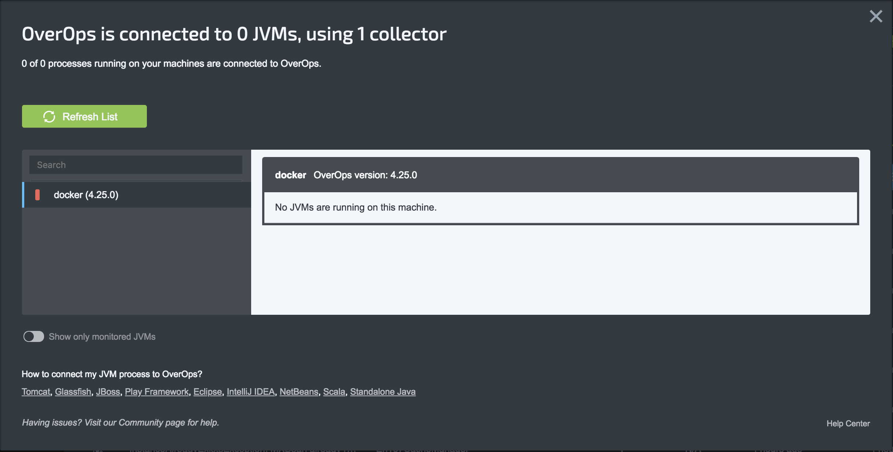

# Deploy a Collector
The Collector [Dockerfile](Dockerfile) is based on the [Linux Rootless Collector Installation](https://doc.overops.com/docs/linux-rootless-collector-install) guide. 

*Before deploying the collector, you'll need to [install Docker and Minikube](../README.md)*

Two files are needed to run this container: `installation.key` and `collector.properties`. The container expects these two files to be contained in a `private` directory which is mounted into the `/opt/takipi/private` directoy in the container.  Alternatively, the Dockerfile can be modified to copy these two files directly into an image. An example [collector.properties](private/collector.properties.saas.example) can be found in this repo. For more details about these files, see the [rootless guide](https://doc.overops.com/docs/linux-rootless-collector-install).

## Build
If you're deploying this image locally on a Minikube cluster, first set the Docker environmental variables:

```console
$ eval $(minikube docker-env)
```

Build the image and tag it `overops-collector`. This may take some time.

```console
$ docker build . -t overops-collector
```

## Run in Docker
This container expects a `private` directory containing `installation.key` and `collector.properties` to be mounted into the `/opt/takipi/private` directory. When running the container, we'll mount the `private` directory into the container. Note that mount paths cannot be relative. We'll also forward port 6060 from the host machine to the container.

```console
$ docker run -p 6060:6060 --mount type=bind,source="$(pwd)"/private,target=/opt/takipi/private overops-collector
```

For debugging, it can be useful to run the container interactively:

```console
$ docker run --mount type=bind,source="$(pwd)"/private,target=/opt/takipi/private -it overops-collector /bin/bash
```

To run in the background:

```console
$ docker run -d -p 6060:6060 --mount type=bind,source="$(pwd)"/private,target=/opt/takipi/private overops-collector
```

## Run in Kubernetes
This container expects a `private` directory containing `installation.key` and `collector.properties` to be mounted into the `/opt/takipi/private` directory. Update the `takipi-private-volume` in [deployment.yaml](deployment.yaml) to point to the correct location. Note that mount paths cannot be relative.

To create a Kubernetes deployment:

```console
$ kubectl create -f deployment.yaml
```

To make our deployment available to other pods running in the cluster, we'll create a service:

```console
$ kubectl create -f service.yaml
```

With the service running, go to [app.overops.com](https://app.overops.com/) and confirm your Collector is connected.



To remove the deployment:

```console
$ kubectl delete -f deployment.yaml
```

To remove the service:

```console
$kubectl delete -f service.yaml
```

## Next Steps

- [Create a Pod Preset for the Agent](agent)
- [Monitoring containerized apps](demos)
